## STANDARD BLOCKS

In this section you will find elements that can be found on many websites and web applications. In general, it is advisable to consider whether a class name can be derived from the semantic HTML. For example  `card__header`,  `card__footer`  or  `list__item`.

### BREADCRUMB

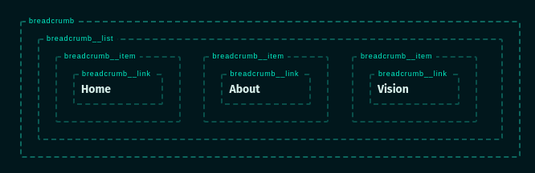

```
<nav class="breadcrumb" aria-label="Breadcrumb">
  <ol class="breadcrumb__list">
    <li class="breadcrumb__item"><a class="breadcrumb__link" href="#">Home</a></li>
    <li class="breadcrumb__item"><a class="breadcrumb__link" href="#">About</a></li>
    <li class="breadcrumb__item"><a class="breadcrumb__link" href="#" aria-current="location">Vision</a></li>
  </ol>
</nav>
```

### NOTE:

Don't use something like  `Breadcrumb Navigation`  for the aria-label as this would result in a screenreader announcing navigation twice.

### BUTTON

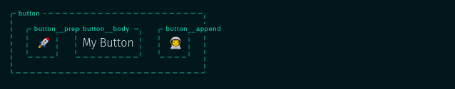

```
<a href="#" class="button">
  <span class="button__prepend">
     🚀
  </span>
  <span class="button__body">My Button</span>
  <span class="button__append">
     👨‍🚀
  </span>
</a>
```

### NOTE:

This Button is more a link than a button. If you have a button in a form that is not a link, you should use a  `<button>`  element instead. Also note that most of the time you don't need an extra  `button__body`  element.

### CARD I

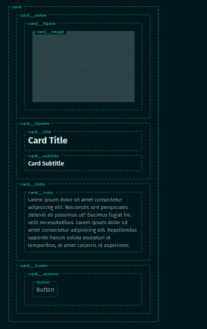

## Card Title

### Card Subtitle

Lorem ipsum dolor sit amet consectetur adipisicing elit. Reiciendis sint perspiciatis deleniti ab possimus ut? Ducimus fugiat hic velit necessitatibus. Lorem ipsum dolor sit amet consectetur adipisicing elit. Repellendus sapiente harum soluta excepturi ut temporibus, at amet corporis id asperiores.

Button

```
<article class="card">
  <aside class="card__aside">
    <figure class="card__figure">
      
    </figure>
  </aside>
  <header class="card__header">
    <h2 class="card__title">Card Title</h2>
    <h3 class="card__subtitle">
      Card Subtitle
    </h3>
  </header>
  <div class="card__body">
    <p class="card__copy">
      Lorem ipsum dolor sit amet consectetur adipisicing elit. Reiciendis sint perspiciatis
      deleniti ab possimus ut? Ducimus fugiat hic velit necessitatibus. Lorem ipsum dolor
      sit amet consectetur adipisicing elit. Repellendus sapiente harum soluta excepturi ut
      temporibus, at amet corporis id asperiores.
    </p>
  </div>
  <footer class="card__footer">
    <div class="card__actions">
      <button class="button">
        Button
      </button>
    </div>
  </footer>
</article>
```

### CARD II

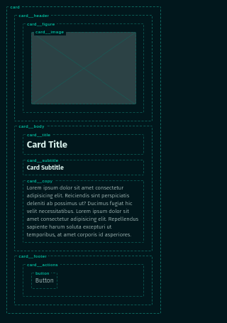
## Card Title

### Card Subtitle

Lorem ipsum dolor sit amet consectetur adipisicing elit. Reiciendis sint perspiciatis deleniti ab possimus ut? Ducimus fugiat hic velit necessitatibus. Lorem ipsum dolor sit amet consectetur adipisicing elit. Repellendus sapiente harum soluta excepturi ut temporibus, at amet corporis id asperiores.

Button

```
<article class="card">
  <div class="card__header">
    <figure class="card__figure">
      
    </figure>
  </div>
  <div class="card__body">
    <h2 class="card__title">Card Title</h2>
    <h3 class="card__subtitle">
      Card Subtitle
    </h3>
    <p class="card__copy">
      Lorem ipsum dolor sit amet consectetur adipisicing elit. Reiciendis sint perspiciatis
      deleniti ab possimus ut? Ducimus fugiat hic velit necessitatibus. Lorem ipsum dolor
      sit amet consectetur adipisicing elit. Repellendus sapiente harum soluta excepturi ut
      temporibus, at amet corporis id asperiores.
    </p>
  </div>
  <footer class="card__footer">
    <div class="card__actions">
      <button class="button">
        Button
      </button>
    </div>
  </footer>
</article>
```

### LIST

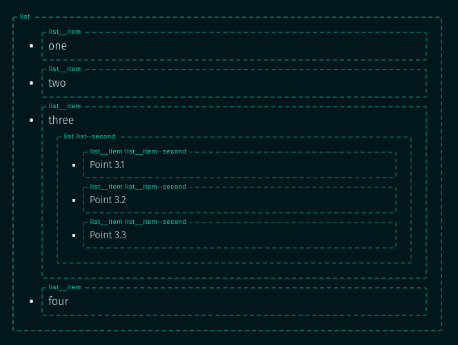

-   one
-   two
-   three
    -   Point 3.1
    -   Point 3.2
    -   Point 3.3
-   four

```
<ul class="list">
  <li class="list__item">one</li>
  <li class="list__item">two</li>
  <li class="list__item">
    three
    <ul class="list list--second">
      <li class="list__item list__item--second">Point 3.1</li>
      <li class="list__item list__item--second">Point 3.2</li>
      <li class="list__item list__item--second">Point 3.3</li>
    </ul>
  </li>
  <li class="list__item">four</li>
</ul>
```

### NOTE:

It is not uncommon that you have to design several different lists on one page. In this case, it is a good idea to add an extension to the name (separated by a hyphen).  
Something like  `counter-list`,  `article-list`,  `customer-list`.

### NAVIGATION

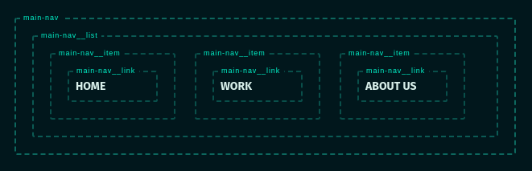

```
<nav class="main-nav" aria-label="Main">
  <ul class="main-nav__list">
    <li class="main-nav__item">
      <a href="#" class="main-nav__link">Home</a>
    </li>
    <li class="main-nav__item">
      <a href="#" class="main-nav__link">Work</a>
    </li>
    <li class="main-nav__item">
      <a href="#" class="main-nav__link">About us</a>
    </li>
  </ul>
</nav>
```

### TABS

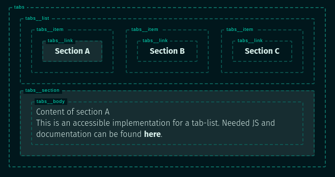

```
<div class="tabs">
  <ul class="tabs__list" role="tablist">
    <li class="tabs__item" role="presentation">
      <a href="#A" class="tabs__link" id="tab-A" role="tab" aria-controls="A" aria-selected="true" tabindex="0">Section A</a>
    </li>
    <li class="tabs__item" role="presentation">
      <a href="#B" class="tabs__link" id="tab-B" role="tab" aria-controls="B" aria-selected="false" tabindex="-1">Section B</a>
    </li>
    <li class="tabs__item" role="presentation">
      <a href="#C" class="tabs__link" id="tab-C" role="tab" aria-controls="C" aria-selected="false" tabindex="-1">Section C</a>
    </li>
  </ul>

  <section id="A" class="tabs__section" role="tabpanel" aria-labelledby="tab-A" aria-hidden="false">
    <div class="tabs__body">
      Content of section A<br>
      This is an accessible implementation for a tab-list. Needed JS and documentation
      can be found <a href="https://codepen.io/2kool2/pen/Kzaddm?editors=0100" omit="" target="_blank">here</a>.
    </div>
  </section>

  <section id="B" class="tabs__section" role="tabpanel" aria-labelledby="tab-B" aria-hidden="true">
    <div class="tabs__body">
      Content of section B
    </div>
  </section>

  <section id="C" class="tabs__section" role="tabpanel" aria-labelledby="tab-C" aria-hidden="true">
    <div class="tabs__body">
      Content of section C
    </div>
  </section>
</div>
```


## FORM BLOCKS

Please note that the input elements do not work in this area. For a live example you can find linked CodePens in some blocks.  
I have to admit that I sometimes omit the class for some elements and address the DOM element directly. For example  `.custom-checkbox > svg`  instead of  `.custom-checkbox__icon`.

### CHECKBOX

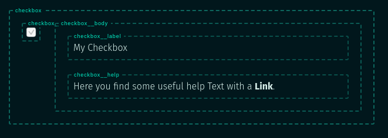

```
<label for="MyCheckbox" class="checkbox">
  <input class="checkbox__input" type="checkbox" id="MyCheckbox">
  <div class="checkbox__body">
    <span class="checkbox__label">My Checkbox</span>
    <span class="checkbox__help">
      Here you find some useful help Text with a <a href="#" omit>Link</a>.
    </span>
  </div>
</label>
```

### NOTE:

The label is the outer node in this example, so you can click anywhere to toggle the checkbox. Naming is a little strange though, as the label is named checkbox and then there is a span named label.

### CUSTOM CHECKBOX
My Checkbox

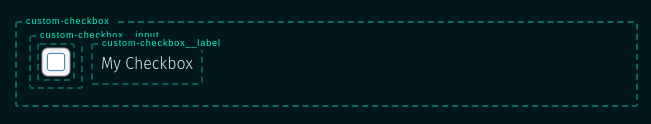

```
<label for="MyCustomCheckbox" class="custom-checkbox">
  <input class="custom-checkbox__input" type="checkbox" id="MyCustomCheckbox">
  <svg class="custom-checkbox__icon" xmlns="http://www.w3.org/2000/svg" viewBox="0 0 22 22">
    <rect width="21" height="21" x=".5" y=".5" fill="#FFF" stroke="#006F94" rx="3" />
    <path class="tick" stroke="#6EA340" fill="none" stroke-linecap="round" stroke-width="4" d="M4 10l5 5 9-9"></path>
  </svg>
  <span class="custom-checkbox__label">My Checkbox</span>
</label>
```

### NOTE:

This is a custom checkbox. For better accessibility the actual input is placed on top of the Icon. Check the html to get a better understanding of the structure. Here you find a working  [Codepen](https://codepen.io/9elements/pen/VwLdogK).

### INPUT GROUP

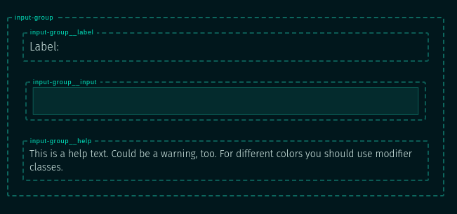

Label:

This is a help text. Could be a warning, too. For different colors you should use modifier classes.

```
<div class="input-group">
  <label for="myInput" class="input-group__label">Label:</label>
  <input type="text" id="myInput" class="input-group__input">
  <span class="input-group__help">
    This is a help text. Could be a warning, too. For different colors you
    should use modifier classes.
  </span>
</div>
```

### NOTE:

If you need different states, you'll have to choose if you want to apply the modifier to the outer input-group like  `.input-group--error`.  
Afterwards, you can either style all child elements accordingly. Or only add a modifier to the element that needs modification (`input-group__help--error`). See this  [Codepen](https://codepen.io/9elements/pen/PoqVMWa)  as a reference.

## LAYOUT BLOCKS

Layout blocks behave somewhat differently than the other blocks on this page. Here the children are addressed via general selectors (like  `> *`  or  `> * + *`). The goal is to create a container in which all kinds of blocks can be placed. Either the number is limited (`imposter`  or  `sidebar`), or any number of children can be inserted (`stack`).  
To make it easier to distinguish them from the others, you can use a prefix (`l-stack`,  `l-sidebar`). It is also a smart idea to specify the distances between the individual elements using this outer layout block. Then the child elements would have no margin.

### IMPOSTER

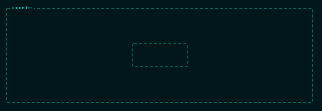

```
<div class="imposter">
  <div></div>
</div>
```

### NOTE:

The impostor creates a container where all child elements are positioned in the center of it. Typically this container would span over the whole viewport (`height: 100vh`  and  `width: 100vw`).

### SIDEBAR

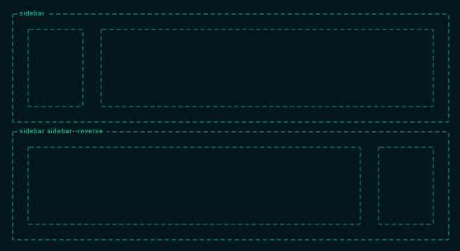

```
<div class="sidebar">
  <aside></aside>
  <div></div>
</div>

<div class="sidebar sidebar--reverse">
  <aside></aside>
  <div></div>
</div>
```

### NOTE:

The Sidebar-Block assumes, that it contains exactly two child elements where the sidebar is the first and the content the second.

### STACK

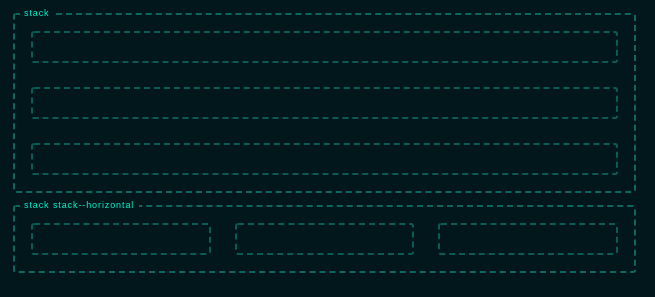

```
<div class="stack">
  <div></div>
  <div></div>
  <div></div>
</div>

<div class="stack stack--horizontal">
  <div></div>
  <div></div>
  <div></div>
</div>
```

### NOTE:

Layout components should be able to nest any type of child element. The component arranges these children and adds gaps if needed. To make it easier to recognise these elements you can use a prefix like  `l-stack`.


### credit
thanks to [this post](https://9elements.com/bem-cheat-sheet/)

